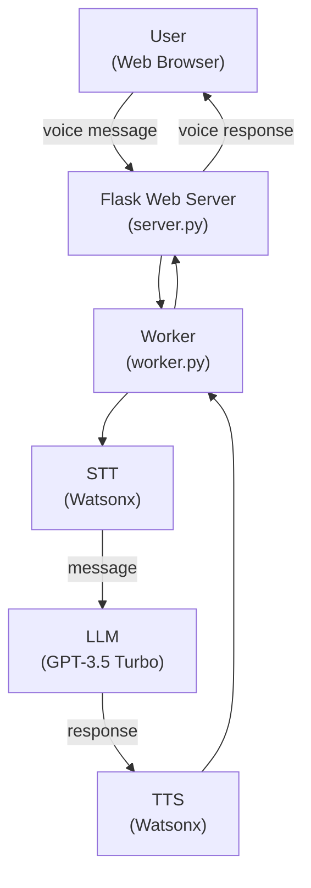

<h1 align="center">🎤 Voice Assistant</h1>

## Introduction

This repository is a fork of IBM's "Chat App with Voice and OpenAI Outline" project. It is designed to showcase how to build a modern chat application that integrates voice capabilities and leverages OpenAI's services to enhance user interaction. The project is primarily developed in JavaScript and is licensed under the Apache License 2.0, making it accessible for modification and use by the open-source community.

## Table of Contents

- [Introduction](#introduction)
- [Prerequirements](#prerequirements)
- [Model](#model)
- [Architecture](#architecture)
- [Features](#features)
- [Installation](#installation)
- [Usage](#usage)
- [License](#license)

## Prerequirements

- Skills Network Labs

## Model

- Speech to text (STT): Model by IBM Watsonx
- Text to speech (TTS): Model by IBM Watsonx
- Process message: GPT-3.5 Turbo by OpenAI

## Architecture



## Features

- Real-time chat functionality
- Voice integration for sending and receiving messages
- Integration with OpenAI for enhanced conversational experiences
- Modular JavaScript codebase
- Open-source Apache 2.0 license
- Based on IBM’s developer skills network outline
- Easy to fork, modify, and extend

## Installation

To run this project on Skills Network Labs, open the Terminal and follow these steps:

1. Clone the repository:

    ```sh
    $ git clone https://github.com/arthurtran04/ibm-voice-assistant.git
    ```

2. Install the required dependencies:

    ```sh
    $ pip install -r requirements.txt
    ```

## Usage

To start the Flask application, run the `cd` command to change the directory to `ibm-voice-assistant` and run the Dockerfile:

   ```sh
   $ cd ./ibm-voice-assistant
   docker build . -t voice-chatapp-powered-by-openai
   docker run -p 8000:8000 voice-chatapp-powered-by-openai
   ```
In the Skills Network Toolkit, launch your application at the port `8000`:

<div align="center"></div>

You can choose the character voice you like, then use your voice to ask questions. The assistant will respond in the voice of the character you chose:

<div align="center"></div>

To stop the application, use `Ctrl + C` in the Terminal

## License

This project is licensed under the Apache-2.0 License. See the LICENSE file for more details.
